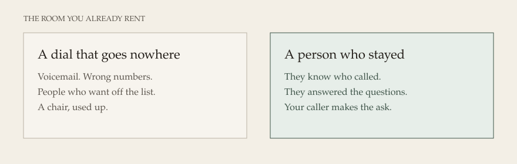
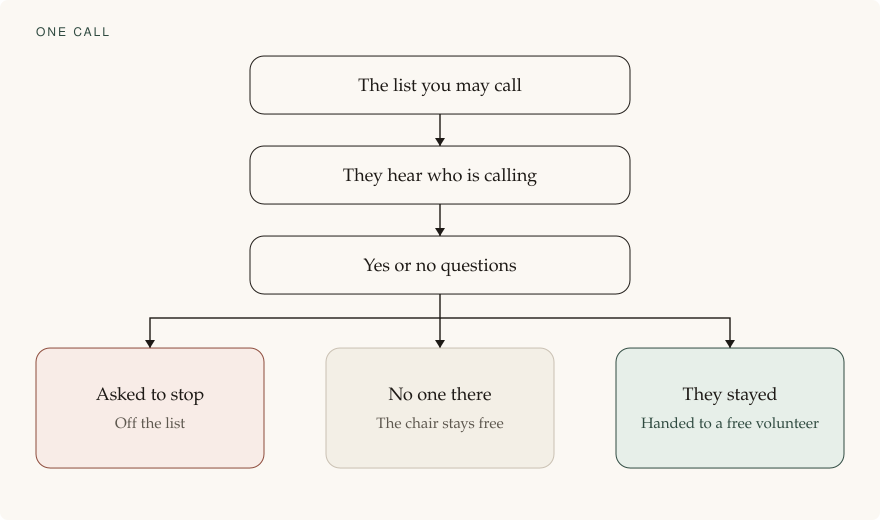
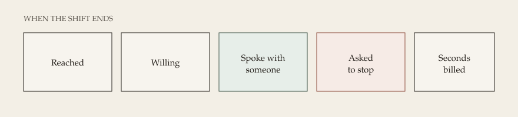

# A room where people are actually on the line

**The day** · [Features](features.md) · [Engineering](engineering.md) · [The rules](compliance.md) · [Glossary](glossary.md) · [Comment on this page](https://github.com/jasincanada/onebc-platform/discussions/1)

Roadmap, page 1 of 3. For Summer. One riding. Daytime. 29 September 2026. A GitHub account is enough to comment.

You have already rented the centre. Your people already know a shift. The missing piece is a chair used for a person who stayed, not for a recording that no one answers.

They hear who is calling. They answer yes or no. If they stay, someone in the room asks for their support. The recording never does. If they want off the list, they are off.

You can walk the floor and know the day. You can stop it. You can set a dollar limit before the first call. You hear the greeting yourself before the room uses it.

This is not switched on. It does not call anyone until you say the shift is ready.

## The handoff

When someone stays, the call moves itself to a free volunteer in the room. The volunteer does not dial. They answer a person who already knows who is calling, and who already said yes.

That is the chair you rented. It is used for the conversation, not for the sorting.

If every volunteer is already talking, the call ends. The person is not left waiting in silence. Someone in the room calls them back later.

## The same room

The centre does not change. The person on the line does.

## One call

The call is handed over only when a volunteer is free to take it.

## The end of the shift

One note. No chase through a pile of paper.

## The rules

This is canvassing of voters and candidates. The recording may say who is calling and ask yes or no. It may not ask for a vote, money, or support. If no one in the room is free, the call ends. Nobody is left on hold. The number on the screen is one the party controls.

A person who asks to stop is removed immediately and kept off the list for at least three years. The list itself stays in Canada. The desk will not dial if the opening, the hours, the permission, or a required election confirmation is missing.

If a named provider refuses this campaign on compliance grounds, dialing stops until a new study names who will actually carry it. Every duty found in the <abbr title="CRTC. The Canadian Radio-television and Telecommunications Commission. It sets the rules for phone calls in Canada.">CRTC</abbr> rules, the privacy duties, and the election filings is on [The rules](compliance.md), with what the desk does about each one. Meeting those duties is the claim. A regulator has not certified the desk. The software is still a draft. Outbound stays off.

Through 24 October 2026. One riding. $800 is my time and the machines I build on. About $700 is an estimate for accounts billed to you, not to me. Phone minutes are yours, counted in steps of six seconds. That is the closest we can get for now. A company that rounds every call up to a full minute will not be used. <abbr title="VoIP.ms. VoIP means a phone call carried over the internet. This is the Canadian phone company.">VoIP.ms</abbr> is the six-second account the riding can use. Telnyx bills full minutes and stays on the doctor search only. They sit outside both figures. Nothing on this page places a call.

[Comment on this page](https://github.com/jasincanada/onebc-platform/discussions/1)
