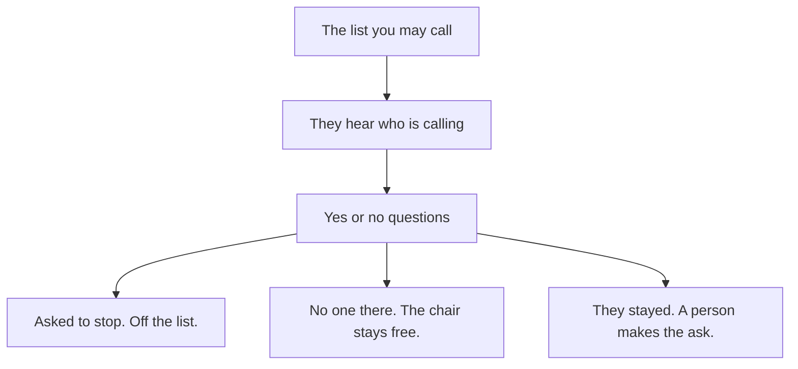

# A room where people are actually on the line

**The day** · [Features](features.md) · [Engineering](engineering.md) · [Comment on this page](https://github.com/jasincanada/onebc-platform/discussions/1)

Roadmap, page 1 of 3. For Summer. One riding. Daytime. 29 September 2026. A GitHub account is enough to comment.

You have already rented the centre. Your people already know a shift. The missing piece is a chair used for a person who stayed, not for a recording that no one answers.

They hear who is calling. They answer yes or no. If they stay, someone in the room asks for their support. The recording never does. If they want off the list, they are off.

You can walk the floor and know the day. You can stop it. You can set a dollar limit before the first call. You hear the greeting yourself before the room uses it.

This is not switched on. It does not call anyone until you say the shift is ready.

## The same room

The centre does not change. The person on the line does.

## One call

A chair is only taken when someone is there to talk to.

## The end of the shift

One note. No chase through a pile of paper.

Through 24 October 2026. One riding. $800 is my time and the machines I build on. About $700 is an estimate for accounts billed to you, not to me. Phone minutes are yours, counted in steps of six seconds. That is the closest we can get for now. A company that rounds every call up to a full minute will not be used. VoIP.ms is the six-second account the riding can use. Telnyx bills full minutes and stays on the doctor search only. They sit outside both figures. Nothing on this page places a call.

[Comment on this page](https://github.com/jasincanada/onebc-platform/discussions/1)
