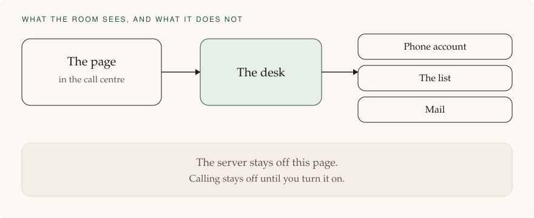

# How it is built, and what is not finished

[The day](README.md) · [Features](features.md) · **Engineering** · [The rules](compliance.md) · [Glossary](glossary.md) · [Comment on this page](https://github.com/jasincanada/onebc-platform/discussions/3)

Roadmap, page 3 of 3. Comments are on the GitHub discussion for that page.

The build is in draft. Calling is off. Nothing on this page, or in those drafts, places a live call by itself.

This public site is the briefing. The riding is its own product, in its own private repository. That product has not been started. Calling is off.

## The shape

The phone line, the trunk, the call control, fax, and mail are separate connections. The desk chooses them from configuration. Business rules do not call a vendor by name.

The customer grant from a Connect button is stored encrypted. A raw key is not stored in the clear. If a vendor has no Connect button, that step stays Not connected. The desk registers its own callbacks. The room is not sent to a vendor page to paste an address.

## The stack

| Piece | Choice |
|---|---|
| Page and desk | <abbr title="Node. Short for Node.js, the program that runs the desk.">Node</abbr> 24, TypeScript 7.0.2. TypeScript has no long-term line, so this is the current stable release. |
| Records | <abbr title="Postgres. Short for PostgreSQL, the database that holds the list.">Postgres</abbr> only. Not flat files, and not a laptop database, for the riding. |
| Server | Ubuntu 26.04.  The list, the notes, and the removal list stay on a machine in Canada. Hillsboro is not used for this riding. Cloudflare's name lookup and front door have no charge, and the list is not cached there. A customer’s own Ubuntu machine is a second profile only if it is in Canada and passes the same checks. A laptop is for building only. |
| Front door | The database is not on the public internet. The page is reached through the outer firewall. Port 8080 is not open. |
| Phone billing | A riding profile may dial when the account bills by the second or in steps of six seconds. No all-in-one provider with true per-second billing is confirmed, so six seconds is allowed for now. <abbr title="VoIP.ms. VoIP means a phone call carried over the internet. This is the Canadian phone company.">VoIP.ms</abbr> publishes six-second billing for Canada and is the riding candidate. Telnyx publishes 60-second billing, says it no longer offers six-second billing, and must not carry this riding. An account that rounds up to a full minute throws before any network call. |

## Where the code stands

Coding help on the Pro plan is spent until 1 October 2026. This product's repository has not been created. Nothing in it can dial, because it does not exist yet.

## Rules the code must keep

- Outbound is off unless the exact live value is set, and only after the second confirmation.
- A missing host profile, a missing phone connection, or a bill that rounds up to a full minute sends nothing. A six-second step is allowed.
- A list with no permission flag dials nothing.
- Stop can list and hang up only the calls this desk owns.
- Customer lists are not copied into the software image.
- Logs do not contain a full phone number.
- On shutdown, new dials pause. A call already up is not dropped outside the stop path.
- The application database role cannot drop tables. Backups go to a second path. The status line is not green without a recent copy there.

No live call has been placed from this work. True per-second billing is not confirmed. Six-second billing is the working rule until a one-second account is found.

[Comment on this page](https://github.com/jasincanada/onebc-platform/discussions/3)
